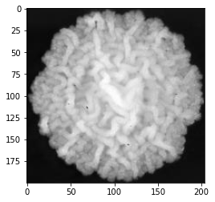
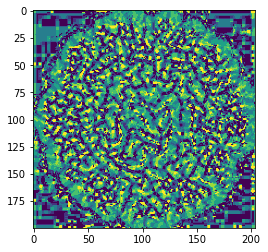
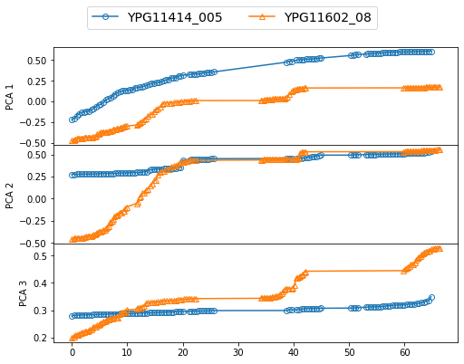

Yeast Morphology Tutorial
=========================

The **yeast-morphology-tutorial** is a set of minimal examples designed to accompany the paper *Quantifying yeast colony morphologies with feature engineering from time-lapse photography*.

Interact with **Examples.ipynb** using *Jupyter*, or read along with the static version, **Examples.html**, using a web browser. 

Follow along with the tutorials to generate the examples shown here and more. 

Gallery
-------

Requirements
------------

- The tutorial requires the scientific data which can be obtained from figshare. 
- Also required is the hiearchical clustering tool, pyprotoclust_.

.. _pyprotoclust: pyprotoclust.readthedocs.io/en/latest/